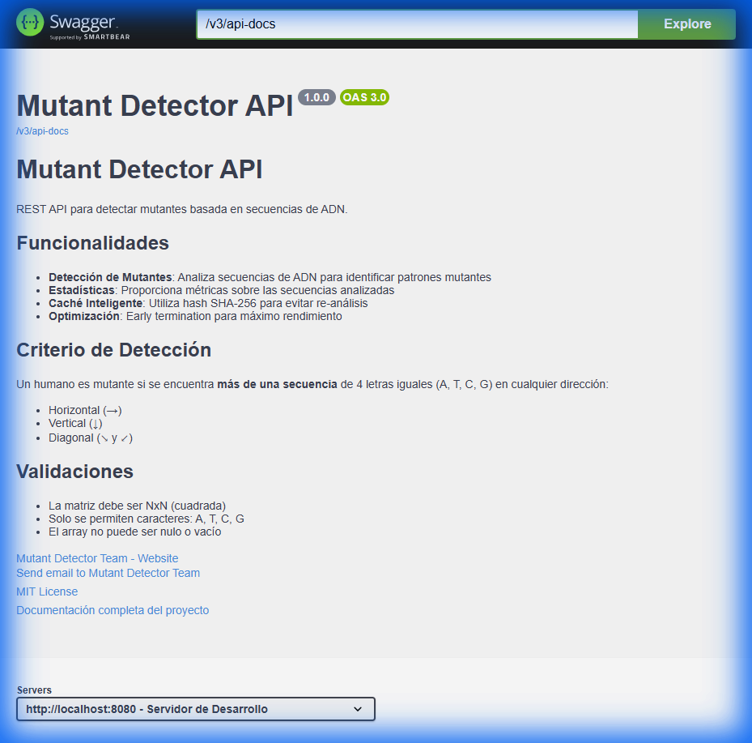

# Mutant Detector API

API REST para detectar mutantes basada en secuencias de ADN. Proyecto desarrollado como parte del desafío de reclutamiento de Magneto para identificar mutantes y ayudar en la lucha contra los X-Men.


---

## Demo Visual



---

## Tabla de Contenidos

- [Descripción](#descripción)
- [Características](#características)
- [Tecnologías](#tecnologías)
- [Instalación y Ejecución](#instalación-y-ejecución)
  - [Opción 1: Docker Compose (Recomendado)](#opción-1-docker-compose-recomendado)
  - [Opción 2: Ejecución Local con Gradle](#opción-2-ejecución-local-con-gradle)
- [Consumo de la API](#consumo-de-la-api)
  - [POST /mutant](#post-mutant)
  - [GET /stats](#get-stats)
  - [Documentación Interactiva](#documentación-interactiva)
- [Testing y Cobertura](#testing-y-cobertura)
- [Arquitectura](#arquitectura)
- [Estructura del Proyecto](#estructura-del-proyecto)
- [Autor](#autor)
- [Licencia](#licencia)

---

## Descripción

Magneto quiere reclutar la mayor cantidad de mutantes posible para poder luchar contra los X-Men. Esta API permite detectar si un humano es mutante basándose en su secuencia de ADN.

**Criterio de Detección:**

Un humano es mutante si se encuentra **más de una secuencia** de cuatro letras iguales (A, T, C, G) en cualquier dirección:
- Horizontal (→)
- Vertical (↓)
- Diagonal descendente (↘)
- Diagonal ascendente (↙)

**Ejemplo de ADN Mutante:**
```
A T G C G A
C A G T G C
T T A T G T
A G A A G G
C C C C T A
T C A C T G
```

En este caso se detectan dos secuencias:
- Diagonal: `ATGT` (posiciones [0,0], [1,1], [2,2], [3,3])
- Horizontal: `CCCC` (fila 4)

---

## Características

- Detección de mutantes con algoritmo optimizado
- Early termination (se detiene al encontrar la 2da secuencia)
- Caché inteligente con hash SHA-256 para evitar re-análisis
- Validación exhaustiva de entrada con anotaciones personalizadas
- Estadísticas en tiempo real
- Documentación interactiva con Swagger/OpenAPI 3.0
- Manejo centralizado de errores
- Cobertura de tests superior al 80%
- Dockerizado con multi-stage build
- Base de datos H2 en memoria (fácilmente migrable a PostgreSQL)

---

## Tecnologías

- **Java 17**
- **Spring Boot 3.2.0**
  - Spring Web
  - Spring Data JPA
  - Spring Validation
- **Gradle 8.5**
- **H2 Database** (en memoria)
- **Lombok** (reducción de boilerplate)
- **SpringDoc OpenAPI** (Swagger UI)
- **JUnit 5** + **Mockito** (testing)
- **Docker** + **Docker Compose**

---

## Instalación y Ejecución

### Prerequisitos

- **Docker** y **Docker Compose** (para la opción recomendada)
- **Java 17** y **Gradle 8.5** (para ejecución local)

### Opción 1: Docker Compose (Recomendado)

La forma más rápida y sencilla de ejecutar la aplicación:

```bash
# Clonar el repositorio
git clone https://github.com/tu-usuario/mutant-detector.git
cd mutant-detector

# Construir y levantar con Docker Compose
docker-compose up --build -d

# Ver logs
docker-compose logs -f

# Detener
docker-compose down
```

La aplicación estará disponible en: **http://localhost:8080**

### Opción 2: Ejecución Local con Gradle

```bash
# Clonar el repositorio
git clone https://github.com/tu-usuario/mutant-detector.git
cd mutant-detector

# Dar permisos de ejecución al wrapper (Linux/Mac)
chmod +x gradlew

# Compilar el proyecto
./gradlew build

# Ejecutar la aplicación
./gradlew bootRun
```

En Windows:
```bash
gradlew.bat build
gradlew.bat bootRun
```

La aplicación estará disponible en: **http://localhost:8080**

---

## Consumo de la API

### POST /mutant

Detecta si una secuencia de ADN pertenece a un mutante.

**Endpoint:** `POST http://localhost:8080/mutant`

**Headers:**
```
Content-Type: application/json
```

**Caso 1: ADN Mutante (Retorna 200 OK)**

```json
{
  "dna": [
    "ATGCGA",
    "CAGTGC",
    "TTATGT",
    "AGAAGG",
    "CCCCTA",
    "TCACTG"
  ]
}
```

**Respuesta:**
```
HTTP/1.1 200 OK
```

**Caso 2: ADN Humano (Retorna 403 Forbidden)**

```json
{
  "dna": [
    "ATGCGA",
    "CAGTGC",
    "TTATTT",
    "AGACGG",
    "GCGTCA",
    "TCACTG"
  ]
}
```

**Respuesta:**
```
HTTP/1.1 403 Forbidden
```

**Caso 3: Validación Fallida (Retorna 400 Bad Request)**

```json
{
  "dna": [
    "ATGCGA",
    "CAGTGC",
    "TTAT"
  ]
}
```

**Respuesta:**
```json
{
  "timestamp": "2025-11-22T12:00:00",
  "status": 400,
  "error": "Bad Request",
  "message": "La validación de restricciones falló",
  "path": "/mutant",
  "details": {
    "dna": "DNA must be NxN matrix. Expected length 6 but got 4 at index 2"
  }
}
```

### GET /stats

Obtiene estadísticas sobre las verificaciones de ADN.

**Endpoint:** `GET http://localhost:8080/stats`

**Respuesta:**
```json
{
  "count_mutant_dna": 40,
  "count_human_dna": 100,
  "ratio": 0.4
}
```

**Descripción de campos:**
- `count_mutant_dna`: Cantidad de mutantes detectados
- `count_human_dna`: Cantidad de humanos detectados
- `ratio`: Ratio de mutantes sobre el total (mutantes / total)

### Documentación Interactiva

La API cuenta con documentación interactiva generada con Swagger/OpenAPI 3.0:

**Swagger UI:** http://localhost:8080/swagger-ui.html

Desde aquí puedes:
- Ver todos los endpoints disponibles
- Probar la API directamente desde el navegador
- Ver ejemplos de request/response
- Consultar los esquemas de datos

---

## Testing y Cobertura

El proyecto cuenta con una suite completa de tests unitarios e integración.

### Ejecutar Tests

```bash
# Ejecutar todos los tests
./gradlew test

# Ejecutar tests de una clase específica
./gradlew test --tests MutantDetectorTest

# Ejecutar tests con reporte detallado
./gradlew test --info
```

### Generar Reporte de Cobertura

```bash
# Generar reporte de cobertura con JaCoCo
./gradlew test jacocoTestReport

# El reporte se genera en:
# build/reports/jacoco/test/html/index.html
```

Abrir el reporte:
```bash
# Windows
start build/reports/jacoco/test/html/index.html

# Linux/Mac
open build/reports/jacoco/test/html/index.html
```

### Cobertura de Tests


**Estadísticas de Testing:**
- **95+ test cases** distribuidos en 3 clases principales
- **Cobertura superior al 80%**
- Tests unitarios con Mockito
- Tests de integración con MockMvc
- Tests de validación exhaustivos

**Clases de Test:**
- `MutantDetectorTest` (40+ tests): Lógica de detección y validación
- `MutantControllerTest` (25+ tests): Endpoints REST
- `StatsServiceTest` (30+ tests): Cálculo de estadísticas

---

## Arquitectura

La aplicación sigue una arquitectura en capas con separación de responsabilidades:

```
┌─────────────────────────────────────────────────────────────┐
│                         Cliente                              │
│                    (HTTP Request)                            │
└────────────────────────┬────────────────────────────────────┘
                         │
                         ▼
┌─────────────────────────────────────────────────────────────┐
│                    Controller Layer                          │
│              (MutantController)                              │
│   - Recibe requests HTTP                                     │
│   - Valida formato JSON                                      │
│   - Retorna respuestas HTTP                                  │
└────────────────────────┬────────────────────────────────────┘
                         │
                         ▼
┌─────────────────────────────────────────────────────────────┐
│                      DTO Layer                               │
│           (DnaRequest, StatsResponse)                        │
│   - Validación con @Valid                                    │
│   - Validación personalizada @ValidDna                       │
│   - Serialización JSON                                       │
└────────────────────────┬────────────────────────────────────┘
                         │
                         ▼
┌─────────────────────────────────────────────────────────────┐
│                    Service Layer                             │
│            (MutantDetectorService)                           │
│   - Lógica de negocio                                        │
│   - Algoritmo de detección de mutantes                       │
│   - Generación de hash SHA-256                               │
│   - Cálculo de estadísticas                                  │
│   - Early termination                                        │
└────────────────────────┬────────────────────────────────────┘
                         │
                         ▼
┌─────────────────────────────────────────────────────────────┐
│                  Repository Layer                            │
│              (DnaRecordRepository)                           │
│   - Interfaz Spring Data JPA                                 │
│   - Queries personalizadas                                   │
│   - Métodos de conteo optimizados                            │
└────────────────────────┬────────────────────────────────────┘
                         │
                         ▼
┌─────────────────────────────────────────────────────────────┐
│                    Database Layer                            │
│                  (H2 Database)                               │
│   - Base de datos en memoria                                 │
│   - Tabla: dna_record                                        │
│   - Índice único en dna_hash                                 │
└─────────────────────────────────────────────────────────────┘
```

### Flujo de Detección de Mutantes

1. **Request HTTP** llega al `MutantController`
2. **Validación DTO** con `@Valid` y `@ValidDna`
   - Verifica que sea matriz NxN
   - Valida caracteres (A, T, C, G)
3. **Cálculo de Hash SHA-256** de la secuencia de ADN
4. **Búsqueda en caché** por hash
   - Si existe: retorna resultado cacheado
   - Si no existe: continúa al paso 5
5. **Algoritmo de detección**
   - Busca secuencias horizontales
   - Busca secuencias verticales
   - Busca secuencias diagonales (ambas direcciones)
   - **Early termination**: se detiene al encontrar la 2da secuencia
6. **Persistencia** del resultado con su hash
7. **Respuesta HTTP**
   - 200 OK si es mutante
   - 403 Forbidden si es humano

### Componentes Principales

**Controller:**
- `MutantController`: Endpoints REST con documentación Swagger

**DTOs:**
- `DnaRequest`: Request con validaciones
- `StatsResponse`: Response de estadísticas
- `ErrorResponse`: Response de errores estructurado

**Service:**
- `MutantDetectorService`: Lógica de detección y estadísticas

**Repository:**
- `DnaRecordRepository`: Acceso a datos con Spring Data JPA

**Entity:**
- `DnaRecord`: Entidad JPA con hash indexado

**Validation:**
- `@ValidDna`: Anotación de validación personalizada
- `DnaValidator`: Implementación del validador

**Exception Handling:**
- `GlobalExceptionHandler`: Manejo centralizado de errores
- `InvalidDnaException`: Excepción de negocio personalizada

---

## Estructura del Proyecto

```
mutant-detector/
├── src/
│   ├── main/
│   │   ├── java/com/mutant/detector/
│   │   │   ├── config/
│   │   │   │   └── SwaggerConfig.java
│   │   │   ├── controller/
│   │   │   │   └── MutantController.java
│   │   │   ├── dto/
│   │   │   │   ├── DnaRequest.java
│   │   │   │   ├── StatsResponse.java
│   │   │   │   └── ErrorResponse.java
│   │   │   ├── entity/
│   │   │   │   └── DnaRecord.java
│   │   │   ├── exception/
│   │   │   │   ├── GlobalExceptionHandler.java
│   │   │   │   └── InvalidDnaException.java
│   │   │   ├── repository/
│   │   │   │   └── DnaRecordRepository.java
│   │   │   ├── service/
│   │   │   │   └── MutantDetectorService.java
│   │   │   ├── validation/
│   │   │   │   ├── ValidDna.java
│   │   │   │   └── DnaValidator.java
│   │   │   └── MutantDetectorApplication.java
│   │   └── resources/
│   │       └── application.properties
│   └── test/
│       └── java/com/mutant/detector/
│           ├── controller/
│           │   └── MutantControllerTest.java
│           └── service/
│               ├── MutantDetectorTest.java
│               └── StatsServiceTest.java
├── gradle/
├── build.gradle
├── settings.gradle
├── gradlew
├── gradlew.bat
├── Dockerfile
├── docker-compose.yml
├── docker-compose-postgres.yml
├── .dockerignore
├── .gitignore
└── README.md
```

---

## Ejemplos de Uso

### Con curl

**Detectar Mutante:**
```bash
curl -X POST http://localhost:8080/mutant \
  -H "Content-Type: application/json" \
  -d '{
    "dna": ["ATGCGA","CAGTGC","TTATGT","AGAAGG","CCCCTA","TCACTG"]
  }'
```

**Obtener Estadísticas:**
```bash
curl http://localhost:8080/stats
```

### Con PowerShell

**Detectar Mutante:**
```powershell
Invoke-RestMethod -Uri "http://localhost:8080/mutant" `
  -Method POST `
  -ContentType "application/json" `
  -Body '{"dna":["ATGCGA","CAGTGC","TTATGT","AGAAGG","CCCCTA","TCACTG"]}'
```

**Obtener Estadísticas:**
```powershell
Invoke-RestMethod -Uri "http://localhost:8080/stats"
```

---

## Optimizaciones Implementadas

### 1. Early Termination
El algoritmo se detiene inmediatamente al encontrar la segunda secuencia mutante, evitando análisis innecesarios.

### 2. Caché con SHA-256
Cada secuencia de ADN se hashea con SHA-256. Si el hash ya existe en la base de datos, se retorna el resultado cacheado sin re-analizar.

### 3. Índice en Base de Datos
El campo `dna_hash` tiene un índice único para búsquedas O(1).

### 4. Validación Temprana
La validación ocurre en la capa de controller antes de llegar al servicio, usando Bean Validation y validadores personalizados.

### 5. Multi-Stage Docker Build
El Dockerfile usa multi-stage build para reducir el tamaño de la imagen final en ~70% (de ~655MB a ~200MB).

---

## Próximos Pasos

- [ ] Migrar a base de datos PostgreSQL para producción
- [ ] Implementar Spring Security con JWT
- [ ] Agregar Spring Boot Actuator para monitoreo
- [ ] Configurar CI/CD con GitHub Actions
- [ ] Desplegar en la nube (AWS/Azure/GCP)
- [ ] Implementar rate limiting
- [ ] Agregar métricas con Prometheus

---

## Autor

**Tu Nombre**
- GitHub: [@tu-usuario](https://github.com/tu-usuario)
- LinkedIn: [Tu Perfil](https://linkedin.com/in/tu-perfil)

---

## Licencia

Este proyecto está bajo la Licencia MIT - ver el archivo [LICENSE](LICENSE) para más detalles.

---

**Desarrollado con ❤️ para el desafío de Magneto**
