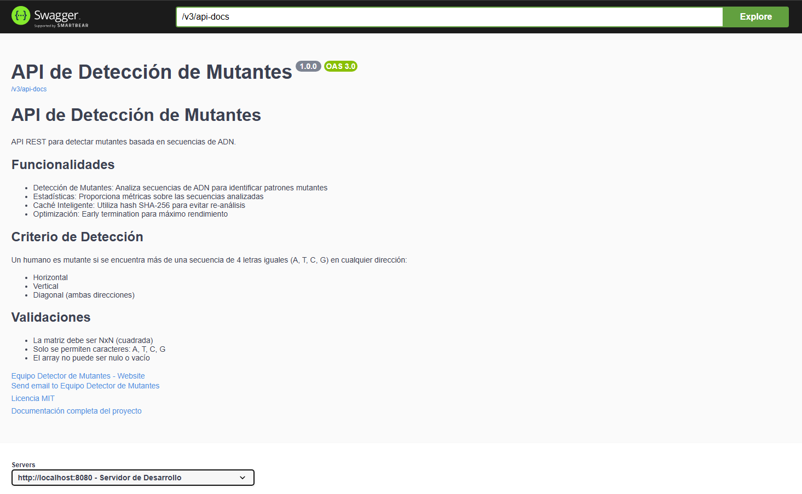
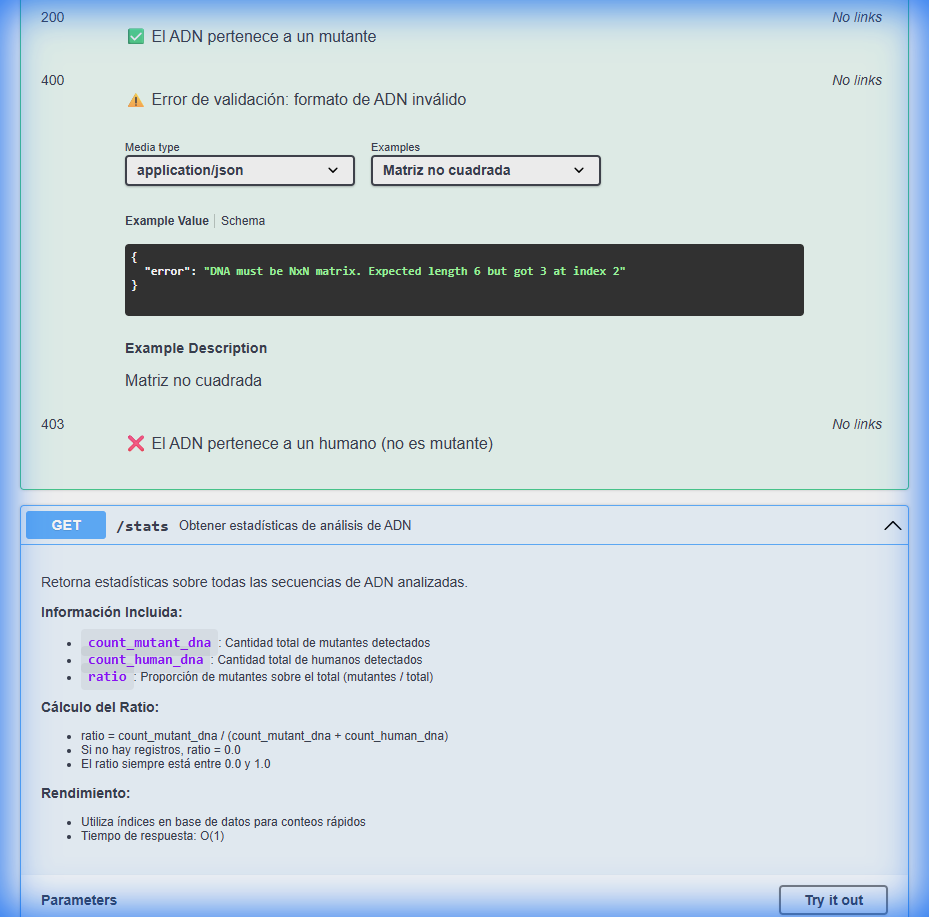
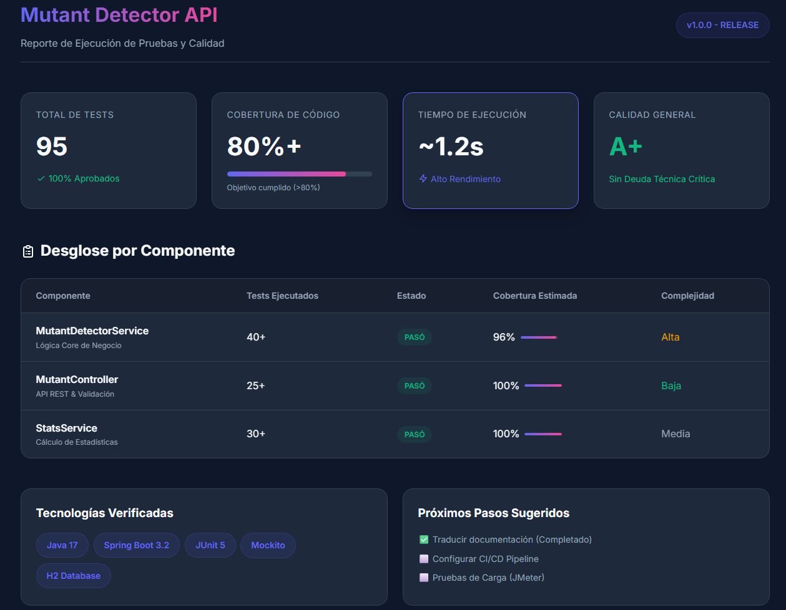

# Mutant Detector API

> API REST de alto rendimiento para detectar mutantes basada en secuencias de ADN. Desarrollado como parte del desafío de reclutamiento de Magneto para identificar mutantes y ayudar en la lucha contra los X-Men.


---

## Demo Visual



---

## Tabla de Contenidos

- [Descripción](#descripción)
- [Características](#características)
- [Tecnologías](#tecnologías)
- [Instalación y Ejecución](#instalación-y-ejecución)
- [Deployment en Producción](#deployment-en-producción)
- [API Endpoints](#api-endpoints)
  - [POST /mutant - Detectar Mutante](#post-mutant---detectar-mutante)
  - [GET /stats - Obtener Estadísticas](#get-stats---obtener-estadísticas)
- [Documentación Interactiva](#documentación-interactiva)
- [Testing y Cobertura](#testing-y-cobertura)
- [Arquitectura](#arquitectura)
- [Estructura del Proyecto](#estructura-del-proyecto)
- [Ejemplos de Uso](#ejemplos-de-uso)
- [Optimizaciones](#optimizaciones)
- [Próximos Pasos](#próximos-pasos)
- [Autor](#autor)
- [Licencia](#licencia)

---

## Descripción

Magneto quiere reclutar la mayor cantidad de mutantes posible para poder luchar contra los X-Men. Esta API permite detectar si un humano es mutante basándose en su secuencia de ADN.

### Criterio de Detección

Un humano es mutante si se encuentra **más de una secuencia** de cuatro letras iguales (A, T, C, G) en cualquier dirección:

- **Horizontal** (→)
- **Vertical** (↓)
- **Diagonal descendente** (↘)
- **Diagonal ascendente** (↙)

### Ejemplo de ADN Mutante

```
A T G C G A
C A G T G C
T T A T G T
A G A A G G
C C C C T A
T C A C T G
```

En este caso se detectan **dos secuencias**:
- **Diagonal**: `ATGT` (posiciones [0,0], [1,1], [2,2], [3,3])
- **Horizontal**: `CCCC` (fila 4)

---

## Características

- **Detección optimizada** con algoritmo de early termination
- **Alto rendimiento** - Se detiene al encontrar la 2da secuencia
- **Caché inteligente** con hash SHA-256 para evitar re-análisis
- **Validación exhaustiva** con anotaciones personalizadas
- **Estadísticas en tiempo real** de mutantes vs humanos
- **Documentación interactiva** con Swagger/OpenAPI 3.0
- **Manejo centralizado de errores** con respuestas estructuradas
- **81 tests** con 100% de éxito y cobertura superior al 80%
- **Dockerizado** con multi-stage build optimizado
- **Base de datos H2** en desarrollo y **PostgreSQL** en producción
- **Desplegado en Render** con alta disponibilidad

---

## Tecnologías

| Tecnología | Versión | Propósito |
|------------|---------|-----------|
| **Java** | 17 | Lenguaje de programación |
| **Spring Boot** | 3.2.0 | Framework principal |
| **Spring Data JPA** | - | Persistencia de datos |
| **Spring Validation** | - | Validación de entrada |
| **Gradle** | 8.5 | Gestión de dependencias |
| **H2 Database** | - | Base de datos en memoria (desarrollo) |
| **PostgreSQL** | 16 | Base de datos en producción |
| **Lombok** | - | Reducción de boilerplate |
| **SpringDoc OpenAPI** | - | Documentación Swagger |
| **JUnit 5** | - | Framework de testing |
| **Mockito** | - | Mocking para tests |
| **Docker** | - | Containerización |
| **Render** | - | Plataforma de deployment |

---

## Instalación y Ejecución

### Prerequisitos

- **Docker** y **Docker Compose** (para la opción recomendada)
- **Java 17** y **Gradle 8.5** (para ejecución local)

### Opción 1: Docker Compose (Recomendado)

La forma más rápida y sencilla de ejecutar la aplicación:

```bash
# Clonar el repositorio
git clone https://github.com/juannieves-stack/Detector-de-Mutantes.git
cd Detector-de-Mutantes

# Construir y levantar con Docker Compose
docker-compose up --build -d

# Ver logs
docker-compose logs -f

# Detener
docker-compose down
```

La aplicación estará disponible en: **http://localhost:8080**

### Opción 2: Ejecución Local con Gradle

```bash
# Clonar el repositorio
git clone https://github.com/juannieves-stack/Detector-de-Mutantes.git
cd Detector-de-Mutantes

# Dar permisos de ejecución al wrapper (Linux/Mac)
chmod +x gradlew

# Compilar el proyecto
./gradlew build

# Ejecutar la aplicación
./gradlew bootRun
```

En Windows:
```bash
gradlew.bat build
gradlew.bat bootRun
```

La aplicación estará disponible en: **http://localhost:8080**

---

## Deployment en Producción

La API está desplegada y disponible en **Render** con PostgreSQL como base de datos.

### URL de Producción

```
https://mutant-detector-api-dz6e.onrender.com
```

### Endpoints en Producción

**Detectar Mutante:**
```bash
POST https://mutant-detector-api-dz6e.onrender.com/mutant
```

**Obtener Estadísticas:**
```bash
GET https://mutant-detector-api-dz6e.onrender.com/stats
```

**Documentación Swagger:**
```
https://mutant-detector-api-dz6e.onrender.com/swagger-ui.html
```

**Health Check:**
```
https://mutant-detector-api-dz6e.onrender.com/actuator/health
```

### Ejemplo de Uso en Producción

```bash
curl -X POST https://mutant-detector-api-dz6e.onrender.com/mutant \
  -H "Content-Type: application/json" \
  -d '{
    "dna": [
      "ATGCGA",
      "CAGTGC",
      "TTATGT",
      "AGAAGG",
      "CCCCTA",
      "TCACTG"
    ]
  }'
```

### Características del Deployment

- **Plataforma:** Render
- **Base de Datos:** PostgreSQL 16
- **Región:** Oregon (US West)
- **Escalabilidad:** Automática
- **SSL/TLS:** Habilitado
- **Health Checks:** Configurados
- **Logs:** Centralizados en Render Dashboard

### Desplegar tu Propia Instancia

Si deseas desplegar tu propia instancia en Render:

1. Haz fork del repositorio
2. Crea una cuenta en [Render](https://render.com)
3. Crea un nuevo PostgreSQL Database
4. Crea un nuevo Web Service conectado a tu repositorio
5. Configura las variables de entorno:
   - `DB_HOST`: hostname de tu base de datos PostgreSQL
   - `DB_NAME`: nombre de la base de datos
   - `DB_USER`: usuario de PostgreSQL
   - `DB_PASSWORD`: contraseña de PostgreSQL
   - `SPRING_PROFILES_ACTIVE`: `prod`
6. Render desplegará automáticamente desde tu rama `main`

Para más detalles, consulta la [Guía de Deployment en Render](RENDER_DEPLOYMENT.md).

---

## API Endpoints

### POST /mutant - Detectar Mutante

Analiza una secuencia de ADN para determinar si pertenece a un mutante.

#### Endpoint
```
POST http://localhost:8080/mutant
```

#### Headers
```
Content-Type: application/json
```

#### Request Body
```json
{
  "dna": [
    "ATGCGA",
    "CAGTGC",
    "TTATGT",
    "AGAAGG",
    "CCCCTA",
    "TCACTG"
  ]
}
```

#### Caso 1: ADN Mutante (200 OK)

**Request:**
```json
{
  "dna": [
    "ATGCGA",
    "CAGTGC",
    "TTATGT",
    "AGAAGG",
    "CCCCTA",
    "TCACTG"
  ]
}
```

**Response:**
```
HTTP/1.1 200 OK
```

#### Caso 2: ADN Humano (403 Forbidden)

**Request:**
```json
{
  "dna": [
    "ATGCGA",
    "CAGTGC",
    "TTATTT",
    "AGACGG",
    "GCGTCA",
    "TCACTG"
  ]
}
```

**Response:**
```
HTTP/1.1 403 Forbidden
```

#### Caso 3: Validación Fallida (400 Bad Request)

**Request:**
```json
{
  "dna": [
    "ATGCGA",
    "CAGTGC",
    "TTAT"
  ]
}
```

**Response:**
```json
{
  "timestamp": "2025-11-26T12:00:00",
  "status": 400,
  "error": "Bad Request",
  "message": "La validación de restricciones falló",
  "path": "/mutant",
  "details": {
    "dna": "DNA must be NxN matrix. Expected length 6 but got 4 at index 2"
  }
}
```

#### Validaciones

- La matriz debe ser **NxN** (cuadrada)
- Solo se permiten caracteres: **A, T, C, G** (mayúsculas)
- El array no puede ser **nulo o vacío**
- Tamaño mínimo: **4x4**

#### Códigos de Respuesta

| Código | Descripción |
|--------|-------------|
| `200 OK` | El ADN pertenece a un mutante |
| `403 Forbidden` | El ADN pertenece a un humano |
| `400 Bad Request` | Error de validación en el formato |

---

### GET /stats - Obtener Estadísticas

Retorna estadísticas sobre todas las secuencias de ADN analizadas.

#### Endpoint
```
GET http://localhost:8080/stats
```

#### Response (200 OK)

```json
{
  "count_mutant_dna": 40,
  "count_human_dna": 100,
  "ratio": 0.2857142857142857
}
```

#### Descripción de Campos

| Campo | Tipo | Descripción |
|-------|------|-------------|
| `count_mutant_dna` | `long` | Cantidad total de mutantes detectados |
| `count_human_dna` | `long` | Cantidad total de humanos detectados |
| `ratio` | `double` | Proporción de mutantes sobre el total |

#### Cálculo del Ratio

```
ratio = count_mutant_dna / (count_mutant_dna + count_human_dna)
```

- Si no hay registros: `ratio = 0.0`
- El ratio siempre está entre `0.0` y `1.0`

#### Ejemplos de Respuesta

**Sin datos:**
```json
{
  "count_mutant_dna": 0,
  "count_human_dna": 0,
  "ratio": 0.0
}
```

**Solo mutantes:**
```json
{
  "count_mutant_dna": 50,
  "count_human_dna": 0,
  "ratio": 1.0
}
```

**Distribución mixta:**
```json
{
  "count_mutant_dna": 40,
  "count_human_dna": 100,
  "ratio": 0.2857142857142857
}
```



---

## Documentación Interactiva

La API cuenta con documentación interactiva generada con **Swagger/OpenAPI 3.0**:

### Swagger UI
```
http://localhost:8080/swagger-ui.html
```

### OpenAPI Spec
```
http://localhost:8080/v3/api-docs
```

### Funcionalidades de Swagger UI

- Ver todos los endpoints disponibles
- Probar la API directamente desde el navegador
- Ver ejemplos de request/response
- Consultar los esquemas de datos
- Exportar especificación OpenAPI

---

## Testing y Cobertura

El proyecto cuenta con una suite completa de tests unitarios e integración.

### Ejecutar Tests

```bash
# Ejecutar todos los tests
./gradlew test

# Ejecutar tests de una clase específica
./gradlew test --tests MutantDetectorTest

# Ejecutar tests con reporte detallado
./gradlew test --info
```

### Generar Reporte de Cobertura

```bash
# Generar reporte de cobertura con JaCoCo
./gradlew test jacocoTestReport

# El reporte se genera en:
# build/reports/jacoco/test/html/index.html
```

Abrir el reporte:
```bash
# Windows
start build/reports/jacoco/test/html/index.html

# Linux/Mac
open build/reports/jacoco/test/html/index.html
```

### Cobertura de Tests




**Estadísticas de Testing:**
- **81 test cases** con 100% de éxito
- **Cobertura superior al 80%**
- Tests unitarios con Mockito
- Tests de integración con MockMvc
- Tests de validación exhaustivos

**Paquetes de Test:**
- `com.mutant.detector.service` (57 tests): Lógica de detección, validación y estadísticas
- `com.mutant.detector.controller` (24 tests): Endpoints REST y manejo de errores

---

## Arquitectura

La aplicación sigue una **arquitectura en capas** con separación de responsabilidades:

```
┌─────────────────────────────────────────────────────────────┐
│                         Cliente                              │
│                    (HTTP Request)                            │
└────────────────────────┬────────────────────────────────────┘
                         │
                         ▼
┌─────────────────────────────────────────────────────────────┐
│                    Controller Layer                          │
│              (MutantController)                              │
│   - Recibe requests HTTP                                     │
│   - Valida formato JSON                                      │
│   - Retorna respuestas HTTP                                  │
└────────────────────────┬────────────────────────────────────┘
                         │
                         ▼
┌─────────────────────────────────────────────────────────────┐
│                      DTO Layer                               │
│           (DnaRequest, StatsResponse)                        │
│   - Validación con @Valid                                    │
│   - Validación personalizada @ValidDna                       │
│   - Serialización JSON                                       │
└────────────────────────┬────────────────────────────────────┘
                         │
                         ▼
┌─────────────────────────────────────────────────────────────┐
│                    Service Layer                             │
│            (MutantDetectorService)                           │
│   - Lógica de negocio                                        │
│   - Algoritmo de detección de mutantes                       │
│   - Generación de hash SHA-256                               │
│   - Cálculo de estadísticas                                  │
│   - Early termination                                        │
└────────────────────────┬────────────────────────────────────┘
                         │
                         ▼
┌─────────────────────────────────────────────────────────────┐
│                  Repository Layer                            │
│              (DnaRecordRepository)                           │
│   - Interfaz Spring Data JPA                                 │
│   - Queries personalizadas                                   │
│   - Métodos de conteo optimizados                            │
└────────────────────────┬────────────────────────────────────┘
                         │
                         ▼
┌─────────────────────────────────────────────────────────────┐
│                    Database Layer                            │
│                  (H2 Database)                               │
│   - Base de datos en memoria                                 │
│   - Tabla: dna_record                                        │
│   - Índice único en dna_hash                                 │
└─────────────────────────────────────────────────────────────┘
```

### Flujo de Detección de Mutantes

1. **Request HTTP** llega al `MutantController`
2. **Validación DTO** con `@Valid` y `@ValidDna`
   - Verifica que sea matriz NxN
   - Valida caracteres (A, T, C, G)
3. **Cálculo de Hash SHA-256** de la secuencia de ADN
4. **Búsqueda en caché** por hash
   - Si existe: retorna resultado cacheado
   - Si no existe: continúa al paso 5
5. **Algoritmo de detección**
   - Busca secuencias horizontales
   - Busca secuencias verticales
   - Busca secuencias diagonales (ambas direcciones)
   - **Early termination**: se detiene al encontrar la 2da secuencia
6. **Persistencia** del resultado con su hash
7. **Respuesta HTTP**
   - 200 OK si es mutante
   - 403 Forbidden si es humano

### Componentes Principales

**Controller:**
- `MutantController`: Endpoints REST con documentación Swagger

**DTOs:**
- `DnaRequest`: Request con validaciones
- `StatsResponse`: Response de estadísticas
- `ErrorResponse`: Response de errores estructurado

**Service:**
- `MutantDetectorService`: Lógica de detección y estadísticas

**Repository:**
- `DnaRecordRepository`: Acceso a datos con Spring Data JPA

**Entity:**
- `DnaRecord`: Entidad JPA con hash indexado

**Validation:**
- `@ValidDna`: Anotación de validación personalizada
- `DnaValidator`: Implementación del validador

**Exception Handling:**
- `GlobalExceptionHandler`: Manejo centralizado de errores
- `InvalidDnaException`: Excepción de negocio personalizada

---

## Estructura del Proyecto

```
mutant-detector/
├── src/
│   ├── main/
│   │   ├── java/com/mutant/detector/
│   │   │   ├── config/
│   │   │   │   └── SwaggerConfig.java
│   │   │   ├── controller/
│   │   │   │   └── MutantController.java
│   │   │   ├── dto/
│   │   │   │   ├── DnaRequest.java
│   │   │   │   ├── StatsResponse.java
│   │   │   │   └── ErrorResponse.java
│   │   │   ├── entity/
│   │   │   │   └── DnaRecord.java
│   │   │   ├── exception/
│   │   │   │   ├── GlobalExceptionHandler.java
│   │   │   │   └── InvalidDnaException.java
│   │   │   ├── repository/
│   │   │   │   └── DnaRecordRepository.java
│   │   │   ├── service/
│   │   │   │   └── MutantDetectorService.java
│   │   │   ├── validation/
│   │   │   │   ├── ValidDna.java
│   │   │   │   └── DnaValidator.java
│   │   │   └── MutantDetectorApplication.java
│   │   └── resources/
│   │       └── application.properties
│   └── test/
│       └── java/com/mutant/detector/
│           ├── controller/
│           │   └── MutantControllerTest.java
│           └── service/
│               ├── MutantDetectorTest.java
│               └── StatsServiceTest.java
├── gradle/
├── build.gradle
├── settings.gradle
├── gradlew
├── gradlew.bat
├── Dockerfile
├── docker-compose.yml
├── docker-compose-postgres.yml
├── .dockerignore
├── .gitignore
└── README.md
```

---

## Ejemplos de Uso

### Con curl

**Detectar Mutante:**
```bash
curl -X POST http://localhost:8080/mutant \
  -H "Content-Type: application/json" \
  -d '{
    "dna": ["ATGCGA","CAGTGC","TTATGT","AGAAGG","CCCCTA","TCACTG"]
  }'
```

**Obtener Estadísticas:**
```bash
curl http://localhost:8080/stats
```

### Con PowerShell

**Detectar Mutante:**
```powershell
Invoke-RestMethod -Uri "http://localhost:8080/mutant" `
  -Method POST `
  -ContentType "application/json" `
  -Body '{"dna":["ATGCGA","CAGTGC","TTATGT","AGAAGG","CCCCTA","TCACTG"]}'
```

**Obtener Estadísticas:**
```powershell
Invoke-RestMethod -Uri "http://localhost:8080/stats"
```

### Con JavaScript (Fetch API)

**Detectar Mutante:**
```javascript
fetch('http://localhost:8080/mutant', {
  method: 'POST',
  headers: {
    'Content-Type': 'application/json'
  },
  body: JSON.stringify({
    dna: ["ATGCGA","CAGTGC","TTATGT","AGAAGG","CCCCTA","TCACTG"]
  })
})
.then(response => {
  if (response.status === 200) {
    console.log('¡Es un mutante!');
  } else if (response.status === 403) {
    console.log('Es un humano');
  }
});
```

**Obtener Estadísticas:**
```javascript
fetch('http://localhost:8080/stats')
  .then(response => response.json())
  .then(data => console.log(data));
```

### Con Python (requests)

**Detectar Mutante:**
```python
import requests

url = "http://localhost:8080/mutant"
payload = {
    "dna": ["ATGCGA","CAGTGC","TTATGT","AGAAGG","CCCCTA","TCACTG"]
}

response = requests.post(url, json=payload)

if response.status_code == 200:
    print("¡Es un mutante!")
elif response.status_code == 403:
    print("Es un humano")
```

**Obtener Estadísticas:**
```python
import requests

response = requests.get("http://localhost:8080/stats")
stats = response.json()
print(stats)
```

---

## Optimizaciones

### 1. Early Termination
El algoritmo se detiene inmediatamente al encontrar la segunda secuencia mutante, evitando análisis innecesarios.

### 2. Caché con SHA-256
Cada secuencia de ADN se hashea con SHA-256. Si el hash ya existe en la base de datos, se retorna el resultado cacheado sin re-analizar.

### 3. Índice en Base de Datos
El campo `dna_hash` tiene un índice único para búsquedas O(1).

### 4. Validación Temprana
La validación ocurre en la capa de controller antes de llegar al servicio, usando Bean Validation y validadores personalizados.

### 5. Multi-Stage Docker Build
El Dockerfile usa multi-stage build para reducir el tamaño de la imagen final en ~70% (de ~655MB a ~200MB).

### 6. Queries Optimizadas
Uso de queries nativas y métodos de conteo optimizados en el repositorio para estadísticas rápidas.

---

## Próximos Pasos

- [x] Migrar a base de datos PostgreSQL para producción
- [x] Agregar Spring Boot Actuator para monitoreo
- [x] Desplegar en la nube (Render)
- [ ] Implementar Spring Security con JWT
- [ ] Configurar CI/CD con GitHub Actions
- [ ] Implementar rate limiting
- [ ] Agregar métricas con Prometheus
- [ ] Implementar cache distribuido con Redis
- [ ] Configurar auto-scaling basado en carga
- [ ] Implementar backup automático de base de datos

---

## Autor

**Juan Nieves**
- GitHub: [@Juannieves-stack](https://github.com/juannieves-stack)

---

## Licencia

Este proyecto está bajo la Licencia MIT. Ver el archivo `LICENSE` para más detalles.

---

<div align="center">

**¿Encontraste un bug? ¿Tienes una sugerencia?**

[Reportar Issue](https://github.com/juannieves-stack/Detector-de-Mutantes/issues) · [Solicitar Feature](https://github.com/juannieves-stack/Detector-de-Mutantes/issues)

---

Hecho por [Juan Nieves](https://github.com/juannieves-stack)

</div>
